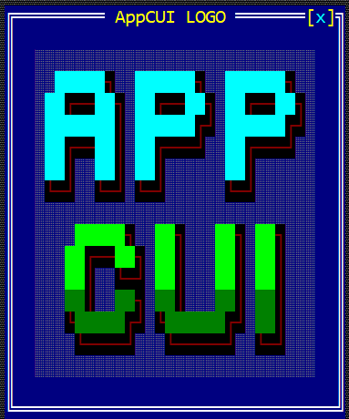
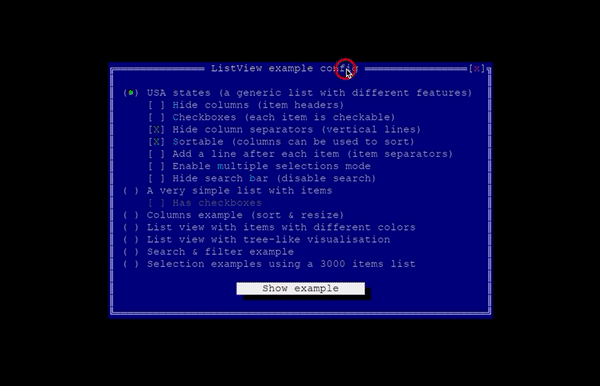
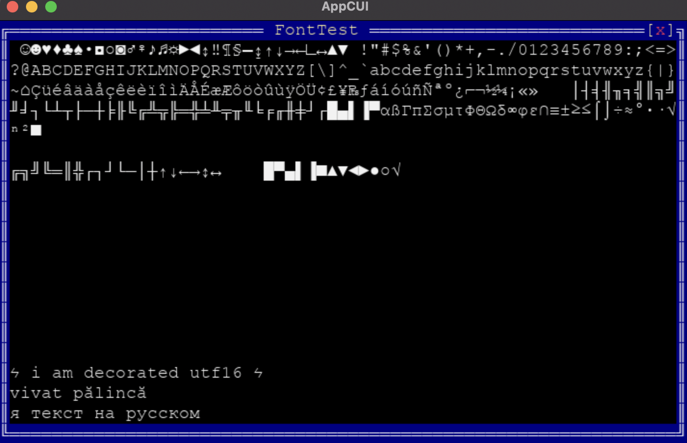

# AppCUI




This logo is an [application](https://github.com/gdt050579/AppCUI/tree/main/Examples/Logo) made with `AppCUI`.

## General description 

**AppCUI** is a cross-platform [TUI](https://en.wikipedia.org/wiki/Text-based_user_interface) builder. The users of this library can construct an interface using its basic building blocks such as: _Window_, _Button_, _Label_, etc.

Generally speaking, the library allows to build a virtual desktop, with multiple windows and extensible components.

The first example is [ListView](https://github.com/gdt050579/AppCUI/tree/main/Examples/ListView), an application to showcase US states and their basic information like _Population_, _Capital_. The user is greeted with an initial window with list view options, like whether the columns are sortable or whether the column separators are visible, after that, a button is pressed to spawn another window with a _list view_, showcasing the US states.



The library displays the whole spectre of ASCII (and ASCII extended, via [Code Page 437](https://en.wikipedia.org/wiki/Code_page_437)) characters, but also a wide range of `UTF16` characters.

In this example we can see the display of characters with values from `0` to `255`, [UTF8 Box Drawing characters](https://en.wikipedia.org/wiki/Box_Drawing), as well as `UTF16` symbols, russian and romanian characters.



## Display

While the rendering of components, layering and colors management is done in the backend, several options are available for display. In here, we call them _Frontends_.

1. `Windows Console` is available on Windows systems and provides full functionality for interaction like mouse click, drag, keyboard, resizing, etc.
2. `SDL2` is available as a frontend for all systems including Windows, OSX and Unix. It also provides full functionality. Apps based on SDL2 will run in a separate window.
3. `NCurses` with limited functionality is available for Unix and OSX systems. Apps based on ncurses will run in any terminal, including `iterm`, `terminal`, `xterm` and so on, but will not have the whole set of mouse movements or access to the full keyboard button range (due to limitations in terminals themselves).

While frontends may be different, AppCUI strives to provide cross-platform support so that the same app looks, feels and behaves the same on every system.

More about frontends can be found [here](https://gdt050579.github.io/AppCUI/terminals.html).

## Advanced documentation

Detailed informations can be found [here](https://gdt050579.github.io/AppCUI/).

## Building

Optionally, you can choose which frontend you want to have on your system:

On Unix and OSX:
- `SDL2` - full functionality, runs in a separate window
- `ncurses` - limited functionality, runs in any terminal

On Windows:
- `SDL2` - full functionality, runs in a separate window
- `Windows Console` - full functionality, runs in the console

### Installing SDL

On OSX
```
brew install sdl2
brew install sdl2_ttf
```

On Linux
```
sudo apt-get install libsdl2-dev -y
sudo apt-get install libsdl2-ttf-dev -y
```

On Windows
```
https://www.libsdl.org/download-2.0.php -> Development Libraries (ex: SDL2-devel-2.0.14-VC.zip)
https://www.libsdl.org/projects/SDL_ttf/ -> Development Libraries (ex: SDL2_ttf-devel-2.0.15-VC.zip)
```

If the libraries are already installed in non-standard paths, use `-DCMAKE_PREFIX_PATH` to specify the path to libraries folders.

For example (from our github workflow on windows)
```
    cmake <other options> -DCMAKE_PREFIX_PATH="C:\SDL\SDL2-2.0.14;C:\SDL\SDL2_ttf-2.0.15"
```

If everything is installed properly, cmake will greet you with `[cmake] Have SDL2`


### Installing Ncurses

On Unix and OSX - the project can also use ncurses. If you have it installed an it's the newest version (6.2 as of writing) - everything should work smoothly. Otherwise, you may need to tell cmake the path to your ncurses

This is done by setting the `-DCMAKE_PREFIX_PATH`

For example: `cmake -DCMAKE_PREFIX_PATH=/opt/homebrew/Cellar/ncurses/6.2`

If everything is installed properly, cmake will greet you with `[cmake] Have Curses`


## Documentation 

The project uses Sphinx as the main documentation engine. Sphinx sources can be located under `docs` folder.

Contributors can install sphinx using `pip install -r requirements.txt`, this will install Sphinx tooling and `sphinx-rtd-theme`. Local building is done with `make html`

After the command executes successfully, the html pages can be found in the `build` folder.

On every commit to `main`, a compiled version of the Sphinx documentation is published to `gh-pages` and then to _https://gdt050579.github.io/AppCUI/_
