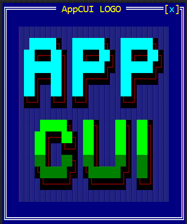
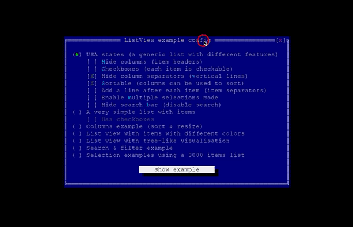
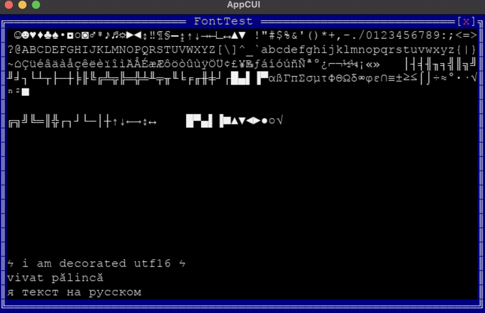
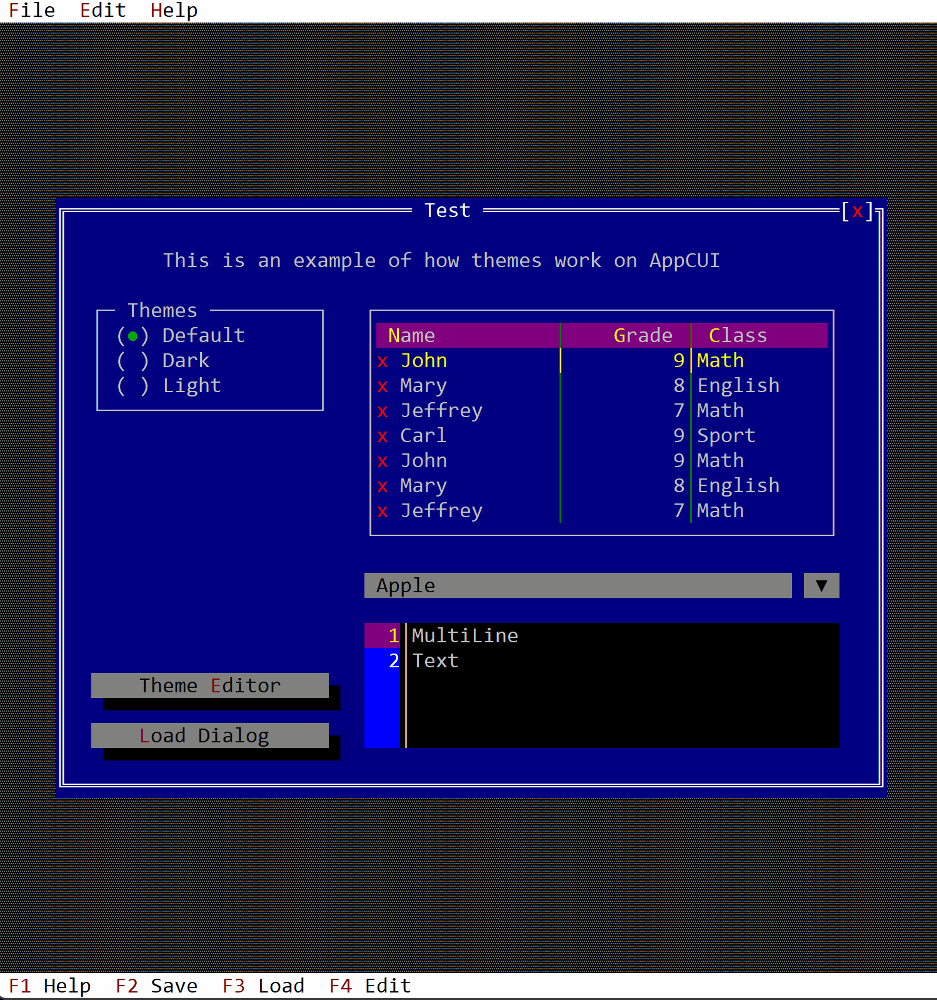

# AppCUI




This logo is an [application](https://github.com/gdt050579/AppCUI/tree/main/Examples/Logo) made with `AppCUI`.

## General description 

**AppCUI** is a cross-platform [TUI](https://en.wikipedia.org/wiki/Text-based_user_interface) builder. The users of this library can construct an interface using its basic building blocks such as: _Window_, _Button_, _Label_, etc.

Generally speaking, the library allows to build a virtual desktop, with multiple windows and extensible components.

The first example is [ListView](https://github.com/gdt050579/AppCUI/tree/main/Examples/ListView), an application to showcase US states and their basic information like _Population_, _Capital_. The user is greeted with an initial window with list view options, like whether the columns are sortable or whether the column separators are visible, after that, a button is pressed to spawn another window with a _list view_, showcasing the US states.




---


The library displays the whole spectre of ASCII (and ASCII extended, via [Code Page 437](https://en.wikipedia.org/wiki/Code_page_437)) characters, but also a wide range of `UTF16` characters.

In this example we can see the display of characters with values from `0` to `255`, [UTF8 Box Drawing characters](https://en.wikipedia.org/wiki/Box_Drawing), as well as `UTF16` symbols, russian and romanian characters.



---

Also check out some of our more advanced controls such as PropertyList that allows one to configure the behavior of different controls or object.


---

AppCUI support themes and the posibility to change and modify the way AppCUI controls are drawn.



---

_AppCUI_ also supports animantions with a stable 30 frames per second, [BadApple](https://github.com/gdt050579/AppCUI/tree/main/Examples/BadApple) is an ascii art animation, that is also a good example of custom drawing and extensibility of components.


## Display

While the rendering of components, layering and colors management is done in the backend, several options are available for display. In here, we call them _Frontends_.

1. `Windows Console` is available on Windows systems and provides full functionality for interaction like mouse click, drag, keyboard, resizing, etc.
2. `SDL2` is available as a frontend for all systems including Windows, OSX and Unix. It also provides full functionality. Apps based on SDL2 will run in a separate window.
3. `NCurses` with limited functionality is available for Unix and OSX systems. Apps based on ncurses will run in any terminal, including `iterm`, `terminal`, `xterm` and so on, but will not have the whole set of mouse movements or access to the full keyboard button range (due to limitations in terminals themselves).
4. `Custom` - a frontend implemented by the application itself (`Application::CustomFrontendInterface`): headless rendering for tests or screenshots, a screen streamed over the network, recorded sessions, ...

While frontends may be different, AppCUI strives to provide cross-platform support so that the same app looks, feels and behaves the same on every system.

More about frontends can be found [here](https://gdt050579.github.io/AppCUI/terminals.html).

## Advanced documentation

Detailed informations can be found [here](https://gdt050579.github.io/AppCUI/).

## Building

AppCUI is a C++20 library built with CMake. Its dependencies (SDL2, SDL2_ttf, FreeType, libpng, libjpeg-turbo, bzip2, brotli and, on Unix / OSX, ncurses) are built automatically by the [vcpkg](https://vcpkg.io) copy included as a git submodule - no manual installation is needed.

```
git clone --recursive https://github.com/gdt050579/AppCUI.git
cd AppCUI
cmake -B build -DCMAKE_BUILD_TYPE=Release
cmake --build build --config Release
```

The library and the examples are written to the `bin` folder. Requirements:
- a C++20 compiler (Visual Studio 2022, GCC, Clang / Xcode command line tools) and CMake 3.13+ (Ninja recommended)
- on Linux, the X11 / OpenGL development packages needed to build SDL2 - the CI uses:
  `sudo apt-get install -y build-essential cmake ninja-build libsdl2-dev libsdl2-ttf-dev libltdl-dev`

If the repository was cloned without `--recursive`, run `git submodule update --init --recursive`. See [Getting started](https://gdt050579.github.io/AppCUI/getting_started.html) for using AppCUI from another CMake project.

## Documentation

The documentation (guides and the API reference of `AppCUI/include/AppCUI.hpp`) is built with Sphinx; the API reference is generated by Doxygen and rendered with Breathe. Sources are in the `docs` folder:

```
cd docs
python -m pip install -r requirements.txt   # Sphinx, Breathe, sphinx-rtd-theme
make html                                   # make.bat html on Windows
```

Doxygen must be installed (or set the `DOXYGEN` environment variable to its path); `APPCUI_DOCS_SKIP_API=1` builds the guides only. The HTML pages are written to `docs/build/html`.

On every commit to `main`, the documentation is built (warnings are errors) and published to `gh-pages`.
